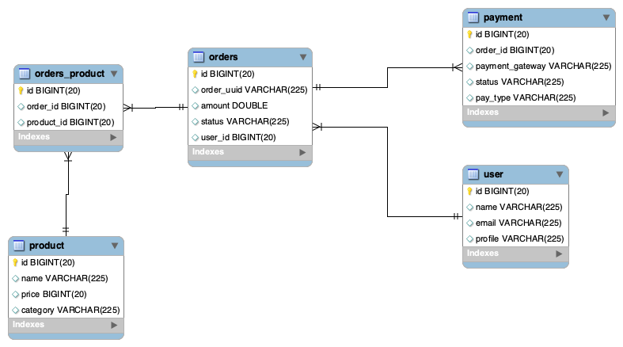

# mars-payment-server

최초 생성 : 2022.11.16
최종 업데이트 : 2022.11.26

## Sequence Diagram

1. 클라이언트에서 카드 정보를 PG 결제 창에 등록한다 (생략)
2. 카드 유효성 체크 결과를 Backend 서버로 redirect

3. (성공 시) PG 서버에 인증용 토큰 발급 요청
    (실패 시) 클라이언트로 실패 화면 응답 return

4. 결재 성공 화면 응답 return

## ERD

## 로컬 환경 구축

- `./docker/mysql/conf/db.cnf`, `/docker/mysql/conf/sql/init-master.sql` 파일 생성

- `startup.sh` 실행

## 기능 명세서

1. 상품
   - 상품 등록
   - 상품 목록
   - 상품 재고 수정
2. 주문
   - 장바구니 기능
     - 인메모리
   - 주문 이력 목록
   - 주문하기, 주문 취소하기
3. 결제
   - 결제하기, 결제 취소하기
   - 결제창 리다이렉트
   - 사용자의 주문 내역과 PG사에서 받은 응답 일치 여부 판단
   - 토큰 유효성 검사
   - 각기 다른 PG사에 연동하기
     - 전략 패턴 사용
4. 유저
   - 회원가입
     - 아이디 중복 유효성 검사
   - 로그인
     - db에 저장된 아이디와 비밀번호 일치 여부만 체크
