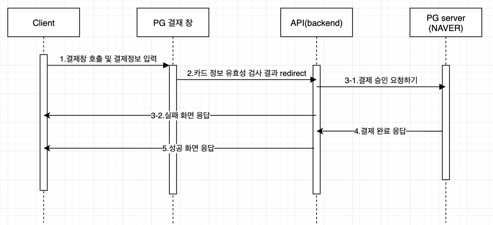
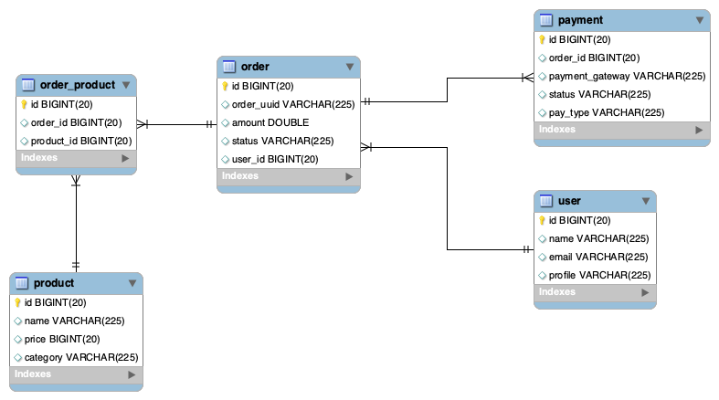

# mars-payment-server

최초 생성 : 2022.11.16
최종 업데이트 : 2022.11.17

## Sequence Diagram

1. 클라이언트에서 카드 정보를 PG 결제 창에 등록한다. (생략)
2. 카드 유효성 체크 결과를 Backend 서버로 redirect

3. (성공 시) PG 서버에 인증용 토큰 발급 요청
    (실패 시) 클라이언트로 실패 화면 응답 return

4. 결재 성공 화면 응답 return

## ERD

