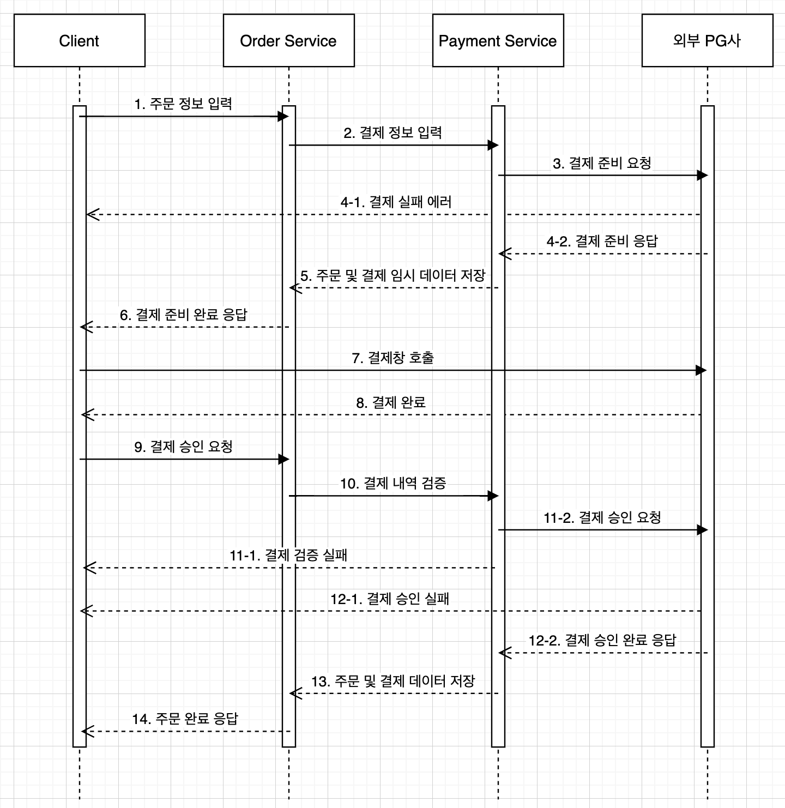

# mars-payment-server

최초 생성 : 2022.11.16
최종 업데이트 : 2022.11.26

## Sequence Diagram

### Order & Payment

1. 클라이언트에서 주문 정보를 입력한다.
2. `OrderService`에서 클라이언트가 준 주문 정보 DTO를 가공하여 `PaymentService`로 결제 정보 DTO를 전송한다.
3. 외부 PG사로 결제 준비 요청을 전송한다.
4. (성공 시) 외부 PG사로부터 결제 준비 응답을 받는다.
   (실패 시) 결제 준비 과정에서 에러가 발생한 경우, 클라이언트로 에러가 전파된다.
5. 주문 및 결제 데이터를 레디스에 저장한다.
6. 외부 PG사로부터 온 결제 준비 응답을 가공하여 클라이언트로 결제 준비 완료 응답 DTO를 전송한다.
7. 클라이언트에서 전달 받은 Url로 리다이렉트한다.
8. 외부 PG사에서 클라이언트에 직접적으로 결제 완료 응답을 보낸다.
9. 클라이언트에서 외부 PG사에서 직접적으로 받은 응답을 토대로 `OrderService`에 결제 승인 요청을 보낸다.
10. `OrderService`에서 전달 받은 DTO를 토대로 유효성 검사를 한다.
11. (성공 시) 외부 PG사로 결제 승인을 요청한다.
    (실패 시) 유효성 검사에 실패한 경우, 클라이언트로 결제 승인 실패 응답을 보낸다.
12. (성공 시) 외부 PG사로부터 결제 승인 완료 응답을 받는다.
    (실패 시) 결제 승인 과정에서 에러가 발생한 경우, 클라이언트로 에러가 전파된다.
13. 결제 승인이 완료되었으므로, 주문 및 결제 데이터를 RDB에 저장한다.
14. 클라이언트로 주문 완료 응답을 보낸다.

## ERD

## 로컬 환경 구축

- `./docker/mysql/conf/db.cnf`, `/docker/mysql/conf/sql/init-master.sql` 파일 생성

- `startup.sh` 실행

## 기능 명세서

1. 상품

- 상품 등록
- 상품 목록
- 상품 재고 수정

2. 주문

- 장바구니 기능
  - 인메모리
- 주문 이력 목록
- 주문하기, 주문 취소하기

3. 결제

- 결제하기, 결제 취소하기
- 결제창 리다이렉트
- 사용자의 주문 내역과 PG사에서 받은 응답 일치 여부 판단
- 토큰 유효성 검사
- 각기 다른 PG사에 연동하기
  - 전략 패턴 사용

4. 유저

- 회원가입
  - 아이디 중복 유효성 검사
- 로그인
  - db에 저장된 아이디와 비밀번호 일치 여부만 체크
